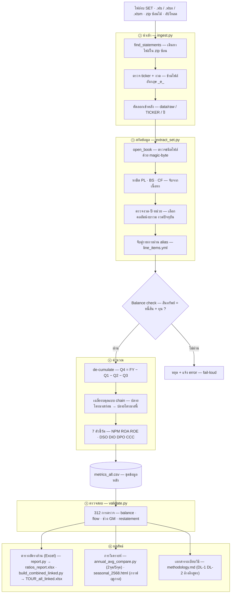

# ผังการทำงานทั้งหมด — TOUR Quarterly Finance Pipeline

จากไฟล์งบที่ตลาดหลักทรัพย์เผยแพร่ ไปจนถึงอัตราส่วน 7 ตัวและรายงานสูตรสด
(หน้านี้ GitHub เรนเดอร์ Mermaid ให้อัตโนมัติ · เวอร์ชันโต้ตอบ: `output/workflow.html`)

## หลักสำคัญ 3 อย่างที่ผังนี้บังคับ

1. **fail-loud** — ถ้า balance ไม่ตรง หรือหา required item ไม่เจอ ระบบหยุดทันที ไม่ปล่อยเลขผิดผ่าน
2. **de-cumulation** — งบไตรมาสไทยเป็นตัวเลข 3 เดือน แต่ Q4 ไม่มีแยก ต้องคำนวณ `FY − Q1 − Q2 − Q3`
3. **chained averaging** — งบไตรมาสเทียบ "ต้นปี" เสมอ จึงต้องต่อยอดปลายไตรมาสก่อนหน้าเป็นต้นงวด เพื่อให้ค่าเฉลี่ยงบดุลถูกต้อง

ทุกอัตราส่วนยึดฐาน CFA (นิยามเดียว สม่ำเสมอทุกบริษัท) ตาม [`methodology.md`](methodology.md)
